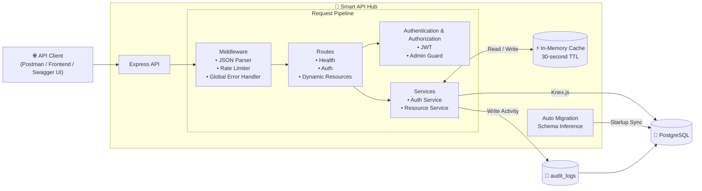

# Project: Smart API Hub

## System Architecture


```

## Tech Stack/Required
- **Backend:** Node.js (>=24), TypeScript(>=7), Express.js(>=5)
- **Database:** PostgreSQL(>=18), Knex.js(>=3)
- **Testing:** Vitest (>=4)
- **Containerization:** Docker, Docker Compose

## Features Checklist
1. Auto Migration
2. Dynamic CRUD
3. Advanced Query (`_sort`, `_limit`, `_search`, ...)
4. Relationships Query (`_expand`, `_embed`)
5. Authentication/Authorization
6. Production Ready (`Global Hanle Error`, `Validation`, `Testing`)
7. Deployment & Docs API

## Installation
### 1. Clone the repository

```bash
git clone https://github.com/nguyenduymanh080302-del/smart-api-hub.git
cd smart-api-hub
```

### 2. Install dependencies

```bash
npm install
```

### 3. Create environment files

Copy the example file:

```bash
cp .env.example .env
cp .env.example .env.production
```

Then update the environment variables in both files.

---

## Development

### 1. Start PostgreSQL

```bash
docker compose up -d
```

### 2. Start the application

```bash
npm run dev
```

The development server will be available at:

```
http://localhost:<PORT>
```

> The development server uses the `.env.development` configuration.

---

## Production

Build and start the application:

```bash
docker compose up --build
```

> The production container uses `.env`.

---

## Running Tests

All API tests are located in:

```
src/tests/api.test.ts
```

Run the test suite:

```bash
npm run test
```
